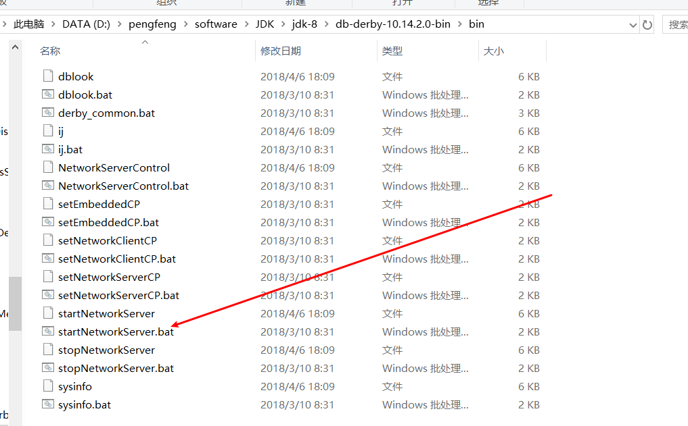

##                  JAVA实现一个基于HTTP协议的简易文件服务器                                                         

### 1.功能需求

#### 1.1 Server端功能需求

##### 1.1.1 上传文件接口

**接口描述：**响应post请求发送过来的文件，接收后对文件进行加密处理，然后对文件进行重命名（命名为UUID同					一识别码），并按照日期(YYYYMMDD)格式保存在服务器的不同目录；并将原始文件名，文件类型，					文件大小，文件保存目录地址，文件加密数字信封等元数据存储在Derby数据库中，同时将生成的统一					识别码UUID返回给客户端。

##### 1.1.2 下载文件接口 

**接口描述：**响应客户端的get请求，其中请求参数为**1.1.1文件上传接口**中返回的UUID。

##### 1.1.3 获取文件元数据接口

**接口描述：**响应客户端的get请求，请求参数为**1.1.1文件上传接口**中返回的UUID，返回值为Json格式信息。

##### 1.1.4 获取最近上传接口

**接口描述：**获取用户最近上传的10个文件的元数据JSON数组。

##### 1.1.5 接口权限校验

**需求描述：**上传文件接口、下载文件接口、获取文件元数据接口都需要校验客户端权限。

**校验规则：**RSA签名校验，Server端持有公钥，Client端持有私钥。

​	1. 客户端向服务器发送请求时，需要在请求头`Header`中添加`X-SID`和`X-Signature`两个属性，SID为客户端随		机生成的字符串，`Signature`为客户端使用`SID`签名后的签名数据，

   					2. 服务端获取`Header`中的`SID`和`Signature`参数，然后用公钥对属性`SID`和`Signature`验签，验证是否合法请求，不合法返回403错误码。

#### 1.2 Client端功能需求

##### 1.2.1 Client端Web服务

​	使用SpringMVC（其他MVC 框架不限）框架实现简单的web 应用，可以响 应前端页面请求，接收前端上传的文件，接收到的文件需要调用Server 端 的文件上传接口，将文件上传至文件服务器，然后调用服务端的的元数据接 口获取文件详细信息返回给前端，响应前端的下载接口，从Server 端下载 文件，解密后返回给前端。 

```
文件解密方法：使用 Client 端持有的私钥，通过非对称加密算法（RSA）对数字信封（保存在元数据中）解密，解密出的结果即为该文件的对称加密秘钥，然后使用 这个对称秘钥对文件用 AES 算法解密即可获取原始文件。 
```

##### 1.2.2 前端页面

​	使用视图层技术（JSP、JSTL、模板、HTML、JavaScript 等具体技术不限）实 现一个简单页面，页面上提供选择文件、上传、展示上传后的文件信息（元 数据）、下载上传后的文件几个功能。 

##### 1.2.3 接口权限校验

​	满足Server端的接口校验要求

##### 1.2.4 列表展示

​	展示最近上传的文件列表。

### 2.技术分析

#### 2.1 数据加解密

​	在我们实际开发过程中，我们都需要对敏感数据进行安全处理。数据安全处理的方法有很多，例如常见的MD5(信息摘要算法)，Base64，SHA256，SHA512。其实这些严格意义上来讲不能算加解密算法，因为数据加解密肯定涉及到秘钥。MD5其实是一种通过哈希算法，将数据运算为固定长度值；Base64其实就是改变数据的编码格式；而SHA-256，SHA-512就是通过哈希函数将消息压缩成摘要，再通过哈希函数将数据形成一个新的哈希散列。

​	加密分为两种：对称加密和非对称加密。

##### 2.1.1 对称加密

​	对称加密就是数据加解密使用同一秘钥。常见的对称加密算法：DES，3DES，AES。因为项目用到了AES，所以这里只介绍AES。

**特点：**算法公开、计算量小、加密速度快、加密效率高 

**AES：**AES加密算法采用分组密码体制，每个分组数据的长度为128位16个字节，密钥长度可以是128位16个字节、192位或256位，一共有四种加密模式，我们通常采用需要初始向量IV的CBC模式，初始向量的长度也是128位16个字节。其加解密流程如下图：


##### 2.1.2 非对称加密

 	公开密钥与私有密钥是一对，如果用公开密钥对数据进行加密，只有用对应的私有密钥才能解密；如果用私有密钥对数据进行加密，那么只有用对应的公开密钥才能解密。 常见的非对称加密算法有：RSA，DSA。

**基本流程：** 甲方生成一对密钥并将其中的一把作为公用密钥向其它方公开；得到该公用密钥的乙方使用该密钥对机密信息进行加密后再发送给甲方；甲方再用自己保存的另一把专用密钥对加密后的信息进行解密。甲方只能用其专用密钥解密由其公用密钥加密后的任何信息。 

**特点：**安全，但是速度较慢

#### 2.2 Derby数据库

​	Derby是一个由Java语言编写的内置数据库。其体积小、易安装。 它的特性却非常丰富。它可以支持关系数据库中的所有企业级的特性，包括崩溃恢复、事务回滚和提交、行 / 表级锁、视图、主键 / 外键约束、触发器、子查询表达式等 

**优缺点：**1. Derby是嵌入式数据库，桌面应用也可以用它来保存配置或其他数据，其做到与文件格式无					关

​				2. 支持临时表，索引，视图，外键，事物等

​				3. 安全性良好

**连接方式：**有内嵌模式和网络模式两种。

##### 2.2.1 内嵌连接模式

内嵌模式： Derby数据库与应用程序共享同一个JVM，通常由应用程序负责启动和停止，对除启动它的					应用程序外的其它应用程序不可见，即其它应用程序不可访问它；  通过Java应用程序访问					内嵌模式Derby数据库时，应用程序有责任需要在程序结束时关闭Derby数据库。

JDBC连接：

```java
// 内嵌形式加载数据驱动
Class.forName("org.apache.derby.jdbc.EmbeddedDriver").newInstance();
// D:\\summer位置使用数据库位置，可以使用相对路径，也可以使用绝对路径
Connetction conn = DriverManager.getConnection("jdbc:derby:D:\\summer;create=true'");
```

##### 2.2.2 网络连接模式

网络模式：Derby数据库独占一个JVM，做为服务器上的一个独立进程运行。在这种模式下，允许有多				个应用程序来访问同一个Derby数据库，通过本地IP加默认端口1527(默认端口)进行访问。

首先我们应运行derby包的lib下的startNetWorkServer开启Derby服务器。效果如下图所示：




```java
// 网络模式加载数据驱动
Class.forName("org.apache.derby.jdbc.ClientDriver").newInstance();
Connection conn = DriverManager.getConnection("jdbc:derby://localhost:1527/summer");
```

网络模式和内嵌模式的不同出在于：
A． 数据库连接URL的不同；
B． 应用程序退出时无须关闭Derby数据库；
C． 数据库驱动的不同； 

### 3.参考链接

[博客1]:https://www.cnblogs.com/wkfvawl/p/12091358.html	"Derby数据库的使用"
[博客2]:https://blog.csdn.net/weixin_42518062/article/details/104534608	"SpringBoot实现文件上传下载"
[博客3]:https://blog.csdn.net/gnail_oug/article/details/80324120?depth_1-utm_source=distribute.pc_relevant.none-task&utm_source=distribute.pc_relevant.none-task	"SpringBoot文件上传"
[博客4]:https://www.cnblogs.com/jpfss/p/11014737.html	"数据加解密服务"
[博客5]:https://www.jianshu.com/p/3840b344b27c?utm_campaign=maleskine&amp;utm_content=note&amp;utm_medium=seo_notes&amp;utm_source=recommendation	"AES算法"

### 4.运行流程及截图

### 5.总结

​	在开发文件上传下载服务器中，我遇到了很多问题。

1.  命令行的Derby数据库版本与项目Derby依赖包的版本不兼容，只需将其版本一致就行

2. 在使用jdbc链接Derby数据库时，我们构建的语句应该加上表的模式

   ```java
   // 用户创建的表为APP模式
   SELECT * FROM APP.FILE ORDER BY FILE.CREATE_TIME DESC
   ```

3. 使用`MultipartFile`的transferTo方法自动加上默认路径问题，导致找不到对应的盘符或文件。效果如下图所示

   

   解决方案：添加`commons io`包，调用` FileUtils.copyInputStreamToFile(file.getInputStream(), tempFile)`将目标文件通过输入流传给目标文件。


